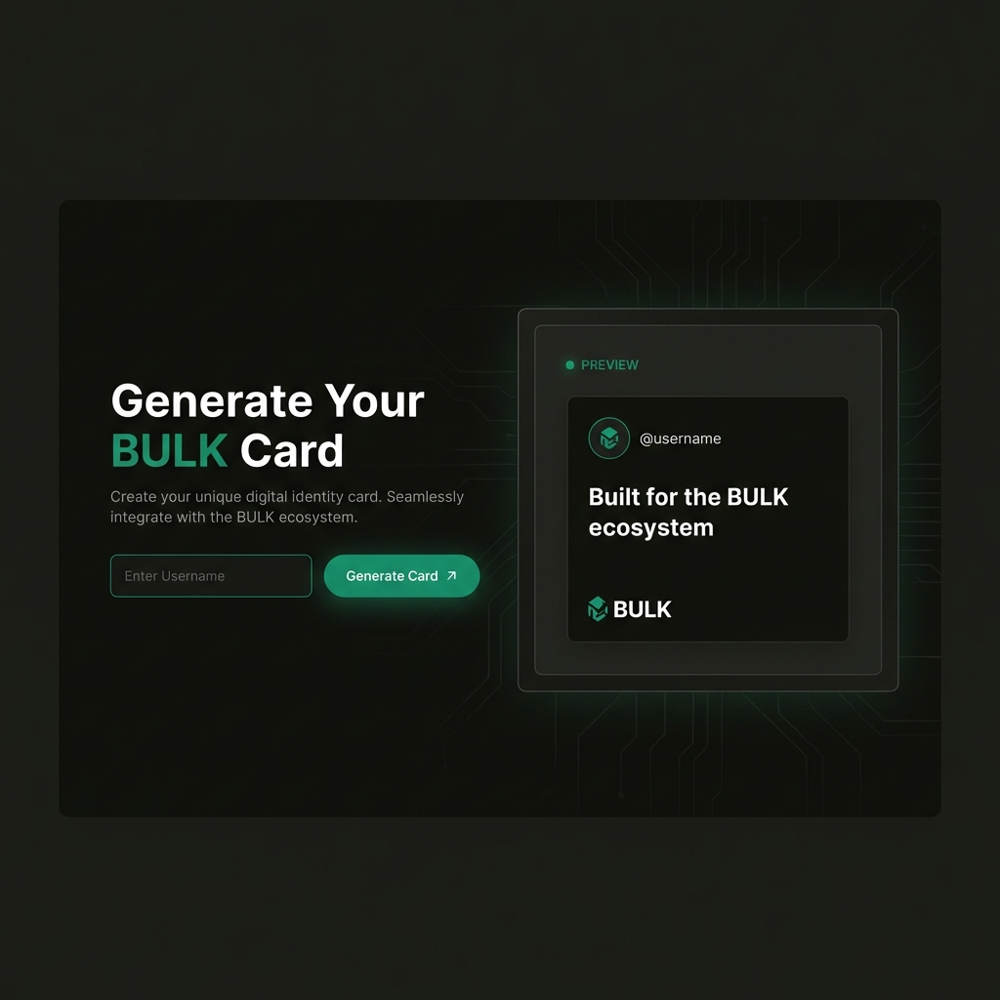

# BULK Card Generator

> A production-quality web application for generating premium BULK-style social cards.



**Built with Next.js, featuring a dark terminal aesthetic inspired by bulk.trade.**

Generate professional social cards for X (Twitter) with a single click. No login, no wallet, no friction.

## Features

- **Instant Card Generation**: Enter any X (Twitter) username and generate a premium card
- **High-Quality Export**: Download cards as 1200×630px PNG images, optimized for social sharing
- **X (Twitter) Sharing**: One-click redirect to share your card on X
- **BULK Design System**: Dark terminal aesthetic with professional, minimal design
- **Robust Avatar Resolution**: Uses unavatar.io with graceful fallback for missing avatars
- **Canvas-Based Rendering**: Reliable, high-quality card rendering with no external dependencies

## Tech Stack

- **Framework**: Next.js 16 (App Router)
- **Language**: TypeScript
- **Styling**: TailwindCSS with BULK design tokens
- **Rendering**: HTML Canvas API
- **Deployment**: Ready for Vercel

## Getting Started

### Installation

```bash
npm install
```

### Development

```bash
npm run dev
```

Open [http://localhost:3000](http://localhost:3000) in your browser.

### Production Build

```bash
npm run build
npm start
```

## Design System

### Color Palette

- **Background**: `#1b1a16` - Deep dark base
- **Panel**: `#24221d` - Slightly lighter surfaces
- **Border**: `#2a2823` - Subtle borders
- **Text**: `#eae7df` - High-contrast text
- **Muted**: `#8f8b86` - Secondary text
- **Accent**: `#139572` - Primary green (CTAs)
- **Error**: `#e23845` - Error/warning states

### Typography

- **Font**: Inter (Google Fonts)
- **Headlines**: Bold, tight tracking
- **Body**: Clean, readable
- **UI Labels**: Uppercase, small, muted

## Project Structure

```
├── app/
│   ├── layout.tsx       # Root layout with metadata
│   ├── page.tsx         # Main application page
│   └── globals.css      # Global styles & design tokens
├── components/
│   ├── Button.tsx       # Button component (primary/secondary)
│   ├── Input.tsx        # Input component with validation
│   └── CardPreview.tsx  # Live card preview component
├── lib/
│   └── cardRenderer.ts  # Canvas rendering & export utilities
└── public/              # Static assets
```

## Deployment

### Vercel (Recommended)

1. Push code to GitHub
2. Import project to Vercel
3. Deploy automatically

```bash
# Or use Vercel CLI
npm i -g vercel
vercel
```

### Environment Variables

No environment variables required. The app is fully frontend-based.

## User Flow

1. User enters X (Twitter) username
2. Card preview generates in real-time
3. User clicks "Download PNG" to save the image
4. User clicks "Share on X" to post (manual image upload)

## Technical Highlights

### Avatar Resolution

- Uses `unavatar.io/twitter/{username}` for reliable avatar fetching
- Automatic fallback to generated avatar if user not found
- CORS-compliant image loading

### Card Rendering

- Canvas-based rendering at 1200×630px (Twitter's recommended size)
- Crisp text rendering with Inter font
- Professional layout with spacing and hierarchy

### Export Quality

- PNG export at 1.0 quality
- Proper filename: `bulk-card-{username}.png`
- Browser-native download (no server required)

## Future Enhancements

The codebase is structured to easily add:

- Multiple card templates
- Light/dark theme toggle
- Custom taglines and colors
- User authentication
- Analytics integration
- Batch card generation

## License

© 2026 BULK. All rights reserved.

## Disclaimer

This application is not affiliated with X Corp (formerly Twitter).
